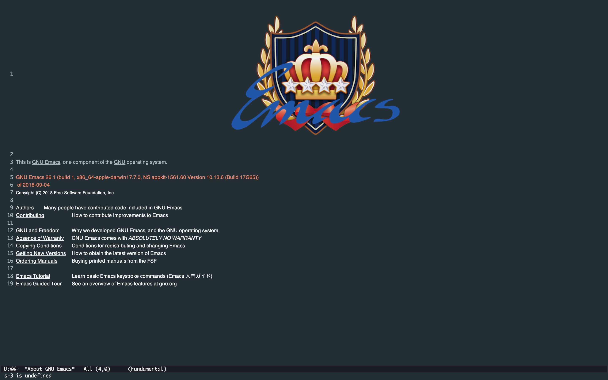

# .emacs.d



## Installation

```sh
git clone git@github.com:wtnbass/.emacs.d.git ~/.emacs.d
```

## Dependencies

### Language Server Protocol

```sh
# lsp-html
npm i -g vscode-html-languageserver-bin

# lsp-css
npm i -g vscode-css-languageserver-bin

# lsp-javascript-typescript
npm i -g javascript-typescript-langserver

# lsp-typescript
npm i -g typescript-language-server

# lsp-vue
npm i -g vue-language-server

# lsp-go
go get -u github.com/sourcegraph/go-langserver
```
